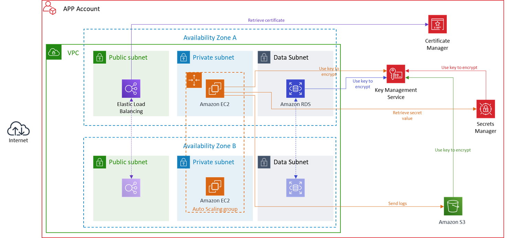
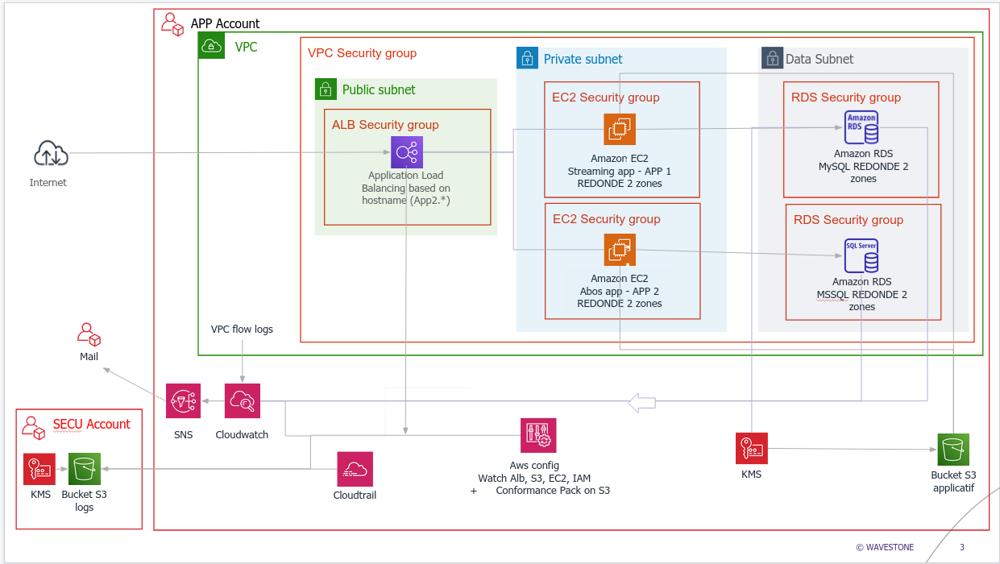
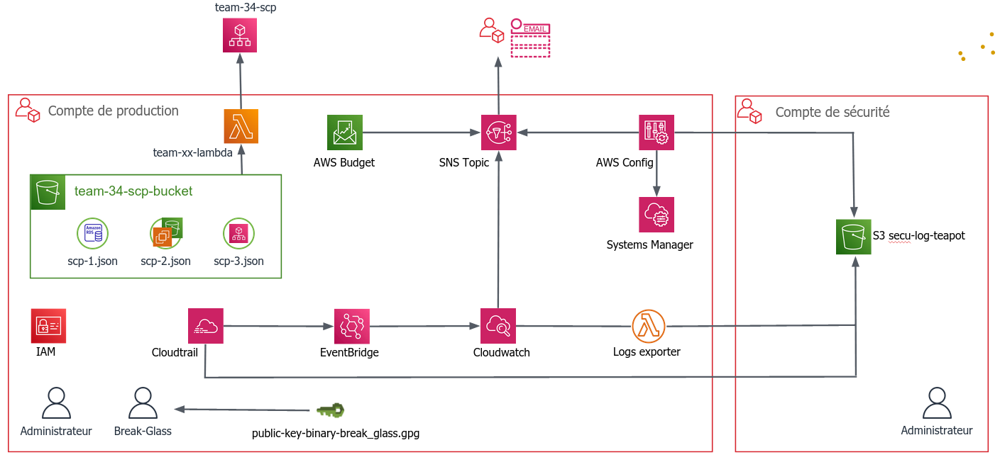

# Secure-AWS-architecture-Terraform

Deployment of secure AWS architectures using terraform

## VERSION 1 (Wavegame 2020)

This diagram belongs to Wavestone, created for the Wavegame contest. We won the AWS challenge with this code. 

We didn't have any personal website to deploy on the servers, so the Certificate Manager is replaced by an IAM certificate on *.amazonaws.com in order to get https.

Please note that varDb.tfvars should not exist for security reasons.

Run with 

$ terraform apply -var-file="varDB.tfvars" -auto-approve

## VERSION 2 (Wavegame 2021)

We won the AWS challenge and the whole competition with this code. I made the schema, it might not be 100% reliable.

You need to put you aws keys into both provider.tf of the app and the secu account before running the code.

Run the secu account first and wait for complete deploy before running the app account. The app account can take some time to deploy, especially the databases (10 minutes).

Run with

$ terraform apply -auto-approve

in both accounts

## VERSION 3 (Wavegame 2022)

We won the AWS challenge with this code and on our way to win the whole competition. I made the schema, it might not be 100% reliable.

Prerequisites :
- Install Terraform
- Install the AWS CLI
- Configure your provider (organisation, identification key and secret key)
- Configure the id of your SCP bucket
- Change the email address subscribed to the SNS topic in the input variables `./prod/variables.tf
- Deploy the security account before deploying the production account code
- Check that the name of the bucket deployed in the security account is correct in the `./prod/variables.tf` file

Remarks
- The test directory could be extended and is not currently used

Useful commands :
|                   |                                        |
|-------------------|----------------------------------------|
| terraform apply   | Ressources creation                    |
| terraform destroy | Ressources destruction                 |
| aws configure     | Set the default aws profile            |
