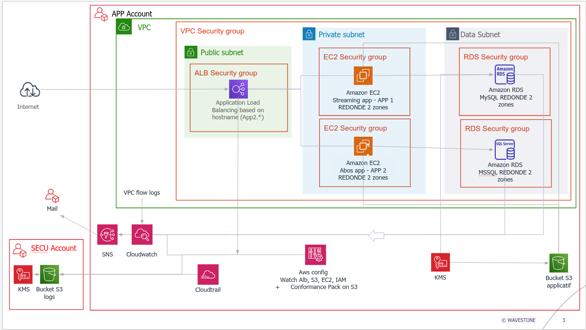

# Secure-AWS-architecture-Terraform

Deployment of secure AWS architectures using terraform

## VERSION 1 (Wavegame 2020)

This diagram belongs to Wavestone, created for the Wavegame contest. We won the AWS challenge with this code. 

We didn't have any personal website to deploy on the servers, so the Certificate Manager is replaced by an IAM certificate on *.amazonaws.com in order to get https.

Please note that varDb.tfvars should not exist for security reasons.

Run with 

$ terraform apply -var-file="varDB.tfvars" -auto-approve

## VERSION 2 (Wavegame 2021)

We won the AWS challenge and the whole competition with this code.

You need to put you aws keys into provider.tf for the app and the secu account

